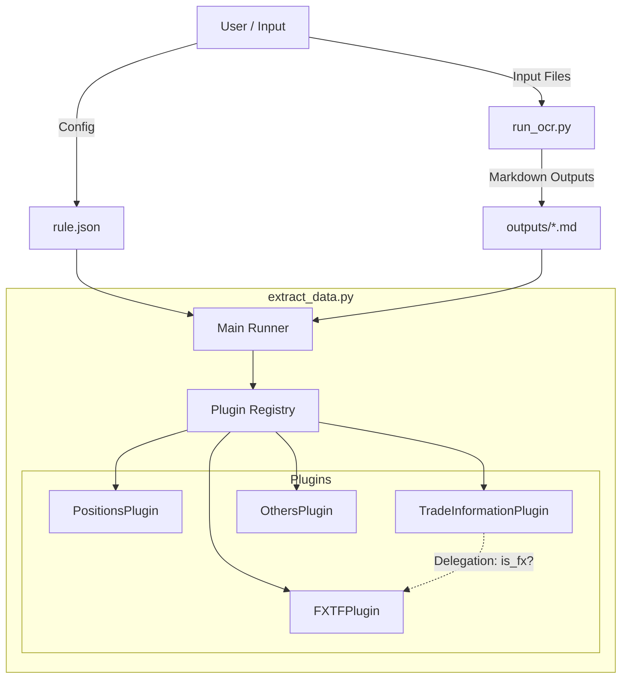
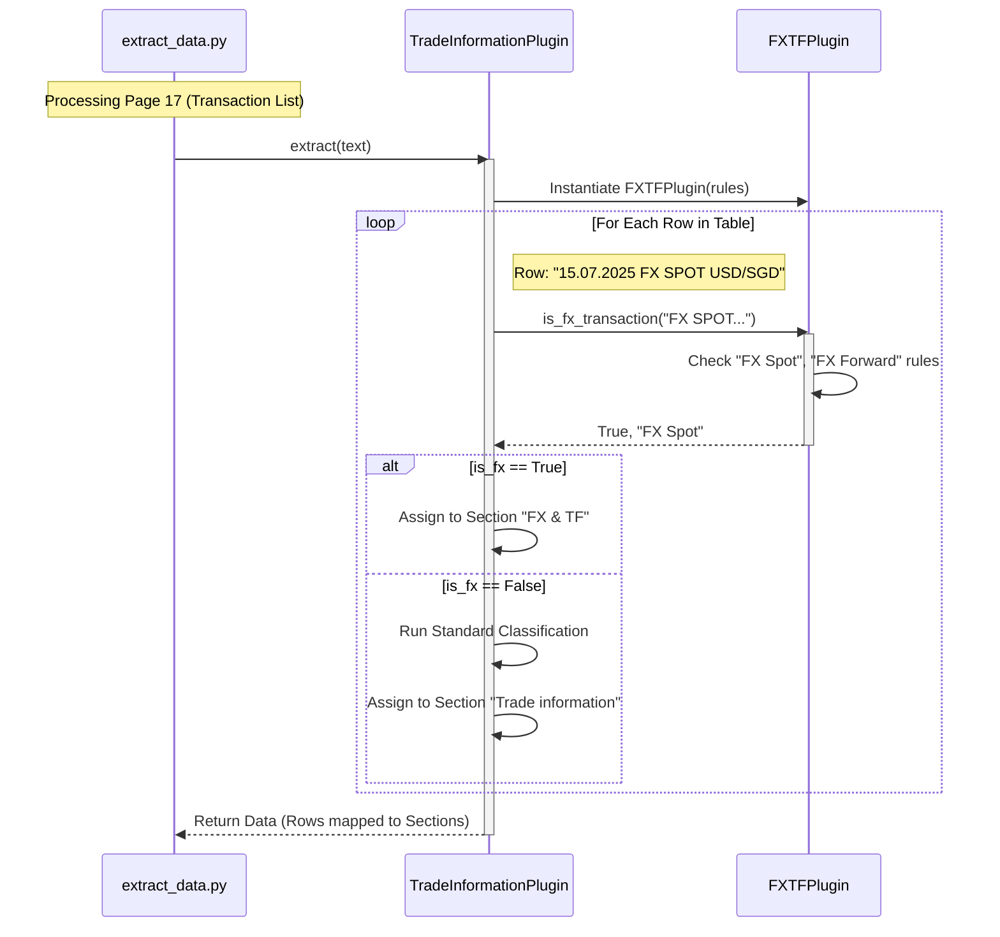

# System Architecture & Flow

## 1. High-Level Component Architecture

This diagram shows how the components interact, from input rules to the plugin-based extraction logic.

## 2. Detailed Execution Sequence (Row Classification)

This sequence diagram details how a specific transaction row is processed, showing the priority check for FX types.

